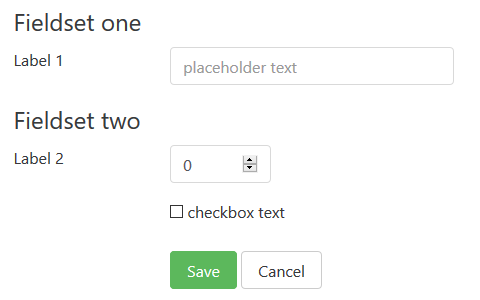

# BootstrapMvc

Extendable packages pack for simplifying Bootstrap markup in your ASP.MVC projects. 

## Packages list

* [BootstrapMvc.Core](https://www.nuget.org/packages/BootstrapMvc.Core/) - core library, containing base clasess only;
* [BootstrapMvc.Bootstrap3](https://www.nuget.org/packages/BootstrapMvc.Bootstrap3/) - helper classes for Bootstrap 3.3 (not complete at this moment), not bound to any MVC version;
* [BootstrapMvc.Bootstrap4](https://www.nuget.org/packages/BootstrapMvc.Bootstrap4/) - helper classes for Bootstrap 4 (`alpha.3`, not complete at this moment), not bound to any MVC version;
* [BootstrapMvc.Mvc5](https://www.nuget.org/packages/BootstrapMvc.Mvc5/) - classes for integrating with ASP.MVC5 infrastructure;
* [BootstrapMvc.Mvc6](https://www.nuget.org/packages/BootstrapMvc.Mvc6/) - classes for integrating with ASP.NET Core / MVC6 infrastructure;
* **[BootstrapMvc.Bootstrap3Mvc5](https://www.nuget.org/packages/BootstrapMvc.Bootstrap3Mvc5/) - 'use-this' package (with correct dependencies) for using in your MVC5 projects.**
* **[BootstrapMvc.Bootstrap3Mvc6](https://www.nuget.org/packages/BootstrapMvc.Bootstrap3Mvc6/) - 'use-this' package (with correct dependencies) for using with `Bootstrap 3` in your ASP.NET Core / MVC6 projects.**
* **[BootstrapMvc.Bootstrap4Mvc6](https://www.nuget.org/packages/BootstrapMvc.Bootstrap4Mvc6/) - 'use-this' package (with correct dependencies) for using with `Bootstrap 4` in your ASP.NET Core / MVC6 projects.**
## Key features

1. **Library decomposition** - allows creating different packages for different Bootstrap and/or Mvc versions with minimal code duplicating and without unneeded dependencies;
2. **Highly extendable** - you can add helper methods to modify/extend existing classes, or add new classes, directly in your MVC project, not in package sources;
3. **Fluent** - write short and efficient code;  
4. **TextWriter-based** - internally, all HTML is written directry to `TextWriter-s`, minimizing String allocation and concatenation;
5. **Open source** - fork it, extend it, use it!

## Usage

Just one sample - input form. Do you remember how much markup you should write? Now you can: 

```csharp
using (var form = Bootstrap.BeginFormFormType.Horizontal))
{
    using (Bootstrap.BeginFormFieldset("Fieldset one"))
    {
        @Bootstrap.FormGroupFor(m => m.StringField)
            .Label("Label 1")
            .Control(Bootstrap.Input().Placeholder("placeholder text"))
    }
    using (form.BeginFieldset("Fieldset two"))
    {
        @form.GroupFor(m => m.IntegerField, "Label 2")
            .Control(Bootstrap.InputInt().Size(0, 3, 3, 3, 3))
        @form.GroupFor(m => m.BooleanField)
            .Control(Bootstrap.Checkbox("checkbox text"))
    }
    using (form.Group().BeginContent())
    {
        @Bootstrap.Button(ButtonType.SuccessGreen, "Save")
        @Bootstrap.Button(ButtonType.SecondaryWhite, "Cancel").Href("/list")
    }
}
```

And you got this:


    

For more samples, visit one of sites: for [Bootstrap 3 in ASP.NET MVC5](http://bootstrap3mvc5.azurewebsites.net/) or for [Bootstrap 3 in ASP.NET Core / MVC6](http://bootstrap3mvc6.azurewebsites.net/) or even for [Bootstrap 4 alpha.3 in ASP.NET Core / MVC6](http://bootstrap4mvc6.azurewebsites.net/)

## Installation for MVC5

### 1. Install package via NuGet

Install [BootstrapMvc.Bootstrap3Mvc5](https://www.nuget.org/packages/BootstrapMvc.Bootstrap3Mvc5/) package from NuGet to your ASP.MVC5 project.

### 2. Modify `Views\web.config` file

Modify your `Views\Web.config` file (and all `Areas\<Area>\Views\Web.config` too), replace base class for views (in `<system.web.webPages.razor>` section), instead:

```xml
<pages pageBaseType="System.Web.Mvc.WebViewPage">
```

write

```xml
<pages pageBaseType="BootstrapMvc.Core.BootstrapViewPage">
```

And add one more `namespace` to namespaces list:

```xml
<add namespace="BootstrapMvc" />
```

### 3. Clean and Rebuild your project

Clean and Rebuild you project to activate changes and activate intellisence. Rarely, a Visual Studio restart also needed.

## Installation for ASP.NET Core

### 1. Add correct dependency to `project.json`

```json
"dependencies": {
    ...
    "BootstrapMvc.Bootstrap3Mvc6": "2.3.0"
}
```

```json
"dependencies": {
    ...
    "BootstrapMvc.Bootstrap4Mvc6": "1.0.0-*"
}
```

**RTM** build of ASP.NET Core / MVC6 is supported.

### 2. Update `Views\_ViewImports.cshtml` file

Add two lines to `Views\_ViewImports.cshtml` file (create it if not exists):

```
@using BootstrapMvc
@inject BootstrapMvc.Mvc6.BootstrapHelper<TModel> Bootstrap
```

### 3. Register in DI container

Append to `ConfigureServices()` method in `Startup.cs` file:
   
```csharp 
services.AddTransient(typeof(BootstrapMvc.Mvc6.BootstrapHelper<>));
```